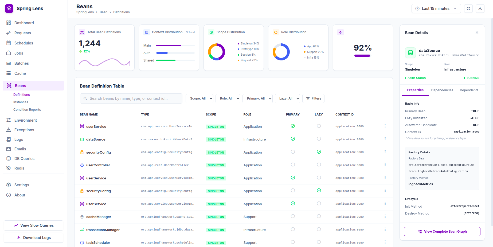

# Spring Lens

Spring Lens is a developer observability and diagnostics tool for Spring Boot applications that provides deep visibility
into your application's runtime behavior with **zero application code changes**. Inspired by Laravel Telescope, Spring
Lens helps developers understand what happens inside their application by collecting and visualizing information about:

* Spring Beans
* HTTP Requests and Responses
* SQL Queries
* Method Executions
* Events
* Caches
* Scheduled Tasks
* Async Operations
* Application Startup

Simply add Spring Lens as a dependency and start exploring your application's internals.

|                                                            |
|:----------------------------------------------------------:|
|  |

## Why Spring Lens?

Modern Spring Boot applications are highly dynamic and heavily rely on auto-configuration, proxies, asynchronous
execution, and runtime infrastructure.

Understanding:

* why startup is slow,
* which beans depend on each other,
* which SQL queries were executed,
* how requests flow through your application,
* or where performance bottlenecks exist

often requires multiple tools, log analysis, and custom instrumentation.

Spring Lens aims to provide all of these insights in one place.

## Features

### Bean Explorer

Inspect your application's Spring container in real time.

Features include:

* Bean definitions
* Bean instances
* Initialization duration
* Scope information
* Dependency graph
* Lazy initialization visibility
* Factory methods
* Bean origin and resource location
* Proxy information
* Startup timeline

### HTTP Request Monitoring

Observe incoming HTTP traffic similar to Laravel Telescope's request watcher.

Captured information includes:

* HTTP method
* URI and query parameters
* Request headers
* Request body
* Response headers
* Response body
* Response status
* Execution duration
* Client IP address
* Correlated SQL executions

### SQL Query Tracking

Monitor database activity generated during request processing.

Features:

* Executed SQL statements
* Execution duration
* Bound parameters
* Exception information
* Request correlation
* Slow query detection

### Method Execution Monitoring

Track application method execution timings.

Features:

* Method name
* Class name
* Execution duration
* Exception information
* Request correlation
* Package filtering

### Startup Diagnostics

Understand exactly how your application starts.

Features:

* Bean initialization timeline
* Slow bean detection
* Startup bottleneck analysis
* Dependency chain visualization

### Dependency Graph Visualization

Explore your Spring application as an interactive graph.

Visualize:

* Bean dependencies
* Bean dependents
* Circular dependencies
* Application architecture

## Zero Configuration Philosophy

Spring Lens is designed around a simple principle:

> Developers should not modify application code to gain observability.

No annotations.

No custom APIs.

No manual registration.

Simply add the dependency:

```xml

<dependency>
    <groupId>com.sdlc.pro</groupId>
    <artifactId>spring-lens-spring-boot-starter</artifactId>
    <version>1.0.0</version>
</dependency>

```

and Spring Lens automatically integrates with your application.

## Architecture

Spring Lens consists of several independent modules:

```text
spring-lens-core
spring-lens-insight
spring-lens-storage
spring-lens-exposure
spring-lens-ui
spring-lens-autoconfigure
spring-lens-starter
```

### spring-lens-core

Provides shared abstractions and infrastructure:

* Repository API
* Pagination
* Filtering
* Sorting
* Shared contracts

### spring-lens-insight

Responsible for runtime information collection:

* Bean observations
* HTTP observations
* SQL observations
* Method observations

### spring-lens-storage

Persistence implementations for collected data.

Supported storage providers:

* In-memory
* Redis
* Custom implementations

### spring-lens-exposure

Exposes collected data through:

* REST API
* Actuator endpoints
* CLI integration
* JMX support

### spring-lens-ui

Default modern UI for insight visualization

### spring-lens-autoconfigure

Connects modules together using Spring Boot auto-configuration.

### spring-lens-starter

Convenient dependency for end users.

## Supported Spring Versions

| Spring Boot | Support |
|-------------|---------|
| 3.x         | ✅       |
| 2.x         | Planned |

## Design Goals

Spring Lens is built around the following principles:

* Zero application code changes
* Production-safe defaults
* Low overhead
* Modular architecture
* Extensible storage model
* Framework-native integration
* Developer-first experience

## Roadmap

### Planned Features

* SQL query monitoring
* Cache monitoring
* Event monitoring
* Scheduler monitoring
* Async execution tracking
* Distributed tracing support
* And many more...

## Comparison

| Feature             | Spring Lens | Spring Boot Actuator | Laravel Telescope |
|---------------------|-------------|----------------------|-------------------|
| Bean Explorer       | ✅           | ❌                    | ❌                 |
| Request Monitoring  | ✅           | Partial              | ✅                 |
| SQL Monitoring      | ✅           | ❌                    | ✅                 |
| Dependency Graph    | ✅           | ❌                    | ❌                 |
| Startup Diagnostics | ✅           | Partial              | ❌                 |
| Zero Code Changes   | ✅           | ✅                    | ✅                 |

## Philosophy

Spring Lens is not intended to replace:

* Spring Boot Actuator
* Micrometer
* OpenTelemetry
* Prometheus

Instead, Spring Lens focuses on one specific problem:

> Giving developers a clear and intuitive understanding of what their Spring application is doing internally.

## Contributing

Contributions, ideas, feature requests, and discussions are welcome.

If you have suggestions or would like to contribute, please open an issue or submit a pull request.

## Inspiration

Spring Lens is heavily inspired by:

* Laravel Telescope
* Spring Boot Actuator
* OpenTelemetry
* Micrometer
* Spring Boot Admin

## Status

Spring Lens is currently under active development.
